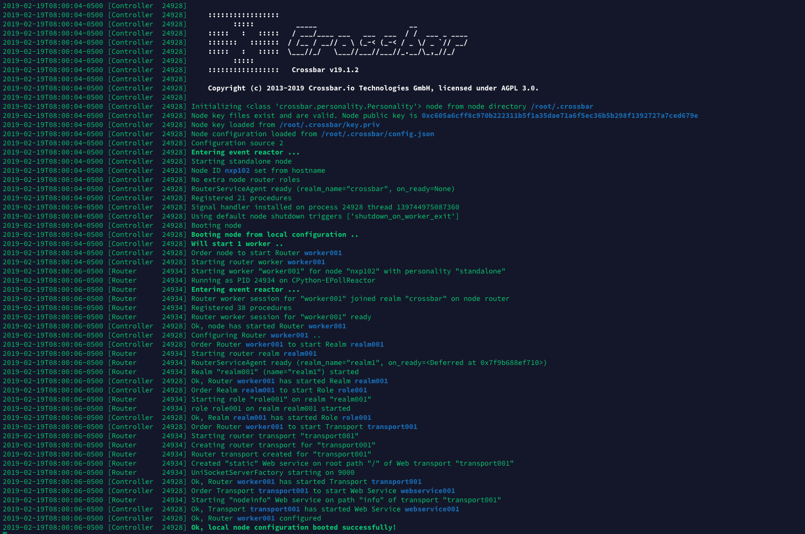

##########################
Creating the GPS Publisher
##########################

Configuring the crossbar.io config file:
========================================

.. code-block:: 
  
 $ sudo nano /PATH_to_home/.crossbar/config.json
  
The important changes to make in regard to the initial default configuration is in the "transports" section, where we define the websocket we want to create (in our case the subdomain autobahn.distributedledger.systems and port 9000): 

.. code-block:: json

  "type": "universal",
  "endpoint": {
      "type": "tcp",
      "port": 9000
  },
  "rawsocket": {},
  "websocket": {
      "ws": {
          "type": "websocket",
          "url": "ws://autobahn.distributedledger.systems:9000"
      }
  },
  
Initializing the crossbar websocket node: 
=========================================

As seen in the image below (https://crossbar.io/static/img/gen/multi_protocol_on_white_paths.svg) the setup requires the initialization of a crossbar node via which to cennect to in order for a subscriber to successfully receive information published. Building on the changes made to the config.json file starting the crossabr node is simple.

.. image:: https://crossbar.io/static/img/gen/multi_protocol_on_white_paths.svg
  :width: 500px
  :height: 500px
  :align: center
  
Initalizing the crossbar node: 
------------------------------

.. code-block:: 

  $ crossbar init
  $ crossbar start
  
The result should give an output like this:

  
We can now connect to the crossbar node via JavaScript: 

.. code-block:: javascript
  
    try {
       // require the autobahn module that was installed via npm, if not globally insert the path to the local node_modules folder
       var autobahn = require('autobahn'); 
    } catch (e) {
       // when running in browser, AutobahnJS will
       // be included without a module system
    }

    var connection = new autobahn.Connection({
       url: 'ws://autobahn.distributedledger.systems:9000/ws',
       realm: 'realm1'}
    );
    
    
For more details and examples how to use the node for publishing and subscribing please refer to the frontend.js and backend.js files
